# SR2025 Competition Setup Plan

The event logistics area is responsible for the setup at the SR2025 competition. Volunteers will be split into teams with a plan for the day, and each team will have a leader.

## Saturday

```mermaid
gantt
    title SR2025 Setup (Thursday)
    dateFormat HH:mm
    axisFormat %H:%M

    section Team A (3)
    Lay test arena carpet :testCarpet, 09:00, 1h
    Lay main arena carpet :mainCarpet, 10:30, 1h
    Lunch :lunchA, 12:30, 1h
    Setup corner screens :setupCornerScreens, 13:30, 2h

    section Team B (4)
    Assemble test arena walls :testWalls, after testCarpet, 1h
    Assemble main arena walls :mainWalls, after mainCarpet, 1h
    Lunch :lunchB, 12:30, 1h

    section Team C (2)
    Setup level 2 helpdesk :l2Helpdesk, 09:00, 1.5h
    Setup score entry table :scoreEntry, after l2Helpdesk, 0.25h
    Setup staging tables :stagingTables, after scoreEntry, 0.25h
    Lunch :lunchC, 12:30, 1h
    Mount and setup arena screens :arenaScreens, 14:30, 1.5h

    section Team D (2)
    Add test arena markings :testMarkings, after testWalls, 1.5h
    Lunch :lunchD, 12:30, 1h
    Add test arena markings :testMarkings2, after lunchD, 0.5h
    Add main arena markings :mainMarkings, after testMarkings2, 2h

    section Team E (2)
    Place test arena wall markers :testWallMarkers, after testWalls, 1.5h
    Lunch :lunchE, 12:30, 1h
    Place main arena wall markers :mainWallMarkers, after lunchE, 1.5h

    section Team F (2)
    Setup livestream :livestream1, 09:00, 3.5h
    Lunch :lunchF, 12:30, 1h
    Setup livestream :livestream2, after lunchF, 2.5h

    section SUSU Crew
    Rig Cube :rigCube, 08:30, 2h
    Lunch :lunchSUSU, 12:30, 1h
```

## Sunday

```mermaid
gantt
    title SR2025 Setup (Friday)
    dateFormat HH:mm
    axisFormat %H:%M

    section Team A (4)
    Clear pit areas :clearPitAreas, 09:00, 1h
    Setup pit tables :setupPitTables, after clearPitAreas, 1h
    Place arena barriers :arenaBarriers, 11:30, 0.5h

    section Team B (2)
    Place venue signage :venueSignage, 09:00, 1h
    Setup reception tables :receptionTables, 10:30, 0.5h
    Label pit tables :labelPitTables, 11:30, 1h

    section Team C (2)
    Setup helpdesk and battery charging :setupHelpdesk, 09:00, 1h
    Setup power tools area :setupPowerTools, after setupHelpdesk, 1h

    section SUSU Crew
    Setup pit power :setupPitPower, 10:30, 1h
    Lunch :lunchSUSU, 12:30, 45m
```

