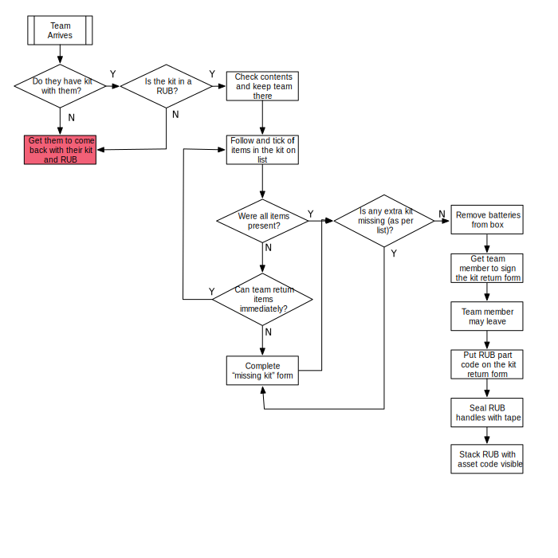

# Kit Return

At the end of the competition (or before if the team wishes to leave early), teams are asked to return their kits to reception. [The docs](https://studentrobotics.org/docs/kit/) notes the list of items issued in the kit, most of which we expect back. At reception, the contents of the RUB should be checked to ensure it contains at least all the items on the Kit Return list. Ensure there is nothing else left in the RUB the team may want back.

!!! note
    Teams wishing to leave the event early (before the closing ceremony) should return their kit to helpdesk instead.

The Kit Return List ([example][kit-return-list]) should be used to ensure all the items are present and correct. One form should be used per team, and this form should be kept to prove the kit was returned correctly. Once completed, keep the form with its respective kit.

When fully checked, the supervisor should fill out the [Kit Return Form][kit-return-form] to confirm everything is complete.

If a team has received a replacement part throughout the year, they may have an additional item. Teams with additional kit should be known in advance.

The workflow is shown in the diagram below.

## International teams

Shipping kits to some international teams can be complex and expensive. If a team is fully intending to compete in the next competition, they may keep their kit, excluding batteries.

This is only allowed for veteran international teams, and must be approved by a Kit Committee member.

## Batteries

As we handle charging during the competition, teams will have 1 Battery. We don't want to keep those in the kits as we want to discharge them and place them with all other batteries. Please remove the battery from the kits, check it off the checklist, and place them in a container to be taken back down to the battery charging area to be storage charged.

## Missing Items

If a kit is not complete, the [Missing Kit Form](https://docs.google.com/document/d/1G9Rv0hWHamecVhk1saslqfMxlYuAg5miJwzOg4GCpVo/edit?usp=sharing) should be completed noting which items of kit have not been returned.

!!! tip
    Ask the team to search their pits again to confirm they haven't missed the forgotten  item

After the competition, these forms are tabulated and the teams contacted to ensure the safe return of the items of kit.

[Example email for teams with outstanding single items of kit](https://github.com/srobo/team-emails/blob/master/SR2019/2019-05-28-single-item-kit-chase.md)

If the team cannot find the item of kit, a like-for-like replacement (or as close as possible) should be ordered and shipped to us.

[kit-return-list]: https://docs.google.com/document/d/11W2pB2FzoIncv22DgOUHnk_hH0bLkGInXoIL7pCbwOA/edit?usp=sharing
[kit-return-form]: https://docs.google.com/document/d/1eegZOBdhhDcwjxq9rwLbtxBbY3gxckNpkNXDLWMA8Yo/edit?usp=sharing
