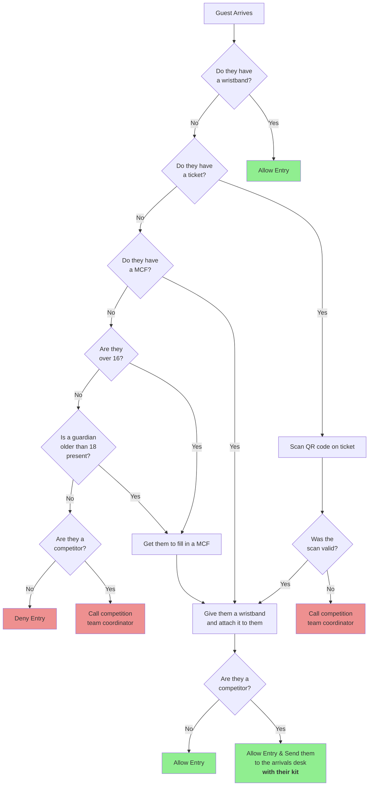

---
original:
  authors: Jeremy Morse, Rob Gilton and Sean Bedford
  url: https://github.com/srobo/comp-team-coord-docs/blob/master/RoleDescriptions/reception.md
  extra: |
    The original work is based on work done by Jeremy Morse, which was under the
    Creative Commons Attribution 4.0 License.  To view a copy of this license,
    visit <a href="https://creativecommons.org/licenses/by/4.0/">https://creativecommons.org/licenses/by/4.0/</a>.
---
# Reception Volunteer

Reception staff control entry to the building and validate people's competition
tickets and/or wristbands. Each reception staffer has a desk, chair, and
computer.

There are four flavours of visitor to the competition: competitors,
team-leaders, volunteers and true-visitors. **Everyone** must complete a media consent form (MCF) OR hold a valid ticket (which also counts as an MCF). Under 16's must have this form completed by a parent or guardian. If someone denies Media Consent, or is under age and doesn't have a form, please speak to the volunteer responsible for Managing Teams.

When someone enters the building, you should follow the procedure below.

**Note: Training on how to use the scanning software will be given on the morning by the competition team coordinator.**

At the start of the competition day, there will be four reception staffers
covering the entrance. Once the initial influx of people is complete, this
will reduce to two. Additionally, after the initial influx, receptionists
should allow people wearing SR wristbands to enter the building at will (they
should check that people walking in have one, or follow the procedure above).

**Note: All receptionists at the start of Saturday will be handling the arrivals desk too.**

Throughout the competition reception staffers will encounter a variety of
members of the public enquiring what the event is, or otherwise receiving
questions. Please answer as fully as possible, but refer any technical questions
to helpdesk, or other unknown matters to other people in SR. Any member
of the public should be allowed into the building if they sign a media consent
form.

The 'crimper' role will also be performed by the receptionist. Please read this document as well for guidance on how to crimp correctly.

After the initial influx of people, the 'arrival-desk' role
will be absorbed by the receptionist. If you have a time slot after the first
slot of the day, read that role description too.

## Required items
You should have the following items present for your duties. If you do not, please let the competition team coordinator know as soon as possible.

* This documentation and flow chart.
* A laptop with scanning software running to scan tickets on entry.
* Spare MCFs to allow visitors to enter.
* Pens to fill in MCFs.
* Wristbands to give to entrants.
* Competitor booklets to give to teams
* Venue maps
* Guest visitor flyers
