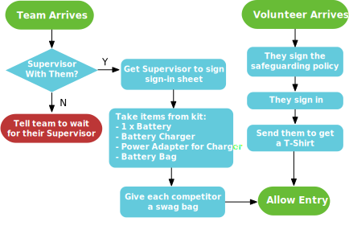

---
original:
  authors: Jeremy Morse, Rob Gilton and Sean Bedford
  url: https://github.com/srobo/comp-team-coord-docs/blob/master/RoleDescriptions/reception.md
  extra: |
    The original work is based on work done by Jeremy Morse, which was under the
    Creative Commons Attribution 4.0 License.  To view a copy of this license,
    visit <a href="https://creativecommons.org/licenses/by/4.0/">https://creativecommons.org/licenses/by/4.0/</a>.
---
# Reception Volunteer

Reception staff control entry to the building and inform attendees that photos and videos are being taken. On top of this, reception staff have a few administrative tasks to do for new team and volunteer arrivals/departures.

Here is a flow chart summarising the details below:

At the start of the competition day, there should be four reception staffers
covering the entrance, and at least 4 chaperones handling individual teams.  Once the initial influx of people is complete, this
will reduce to 1 and 0 respectively. In that case, the receptionist should also perform the chaperone role, minus leading teams to their pits as they shouldn't leave their desk for long periods.

## For All Arrivals

All people that enter the venue should be aware that we're taking photos and videos. There should be signage outside, so don't worry if you miss some people. But do try to check with most people who are arriving for the first time at the event.

### If people object to being recorded

If people do object to being recorded, first explain that we only use footage to advertise ourselves.
If they still object, they should be given a red lanyard and told to wear them at all times, this is to ensure that we do not take photos of them, and if we do we will digitally remove them before publishing photos. We should explain that it would be best for them to avoid being close to arena during matches, as we'll be livestreaming.

## Handling members of the public

Throughout the competition, receptionists typically get a lot of questions by the public. Any member of the public is allowed into the building. You just need to inform them about photos and videos being recorded.

You can give them a booklet and direct them to the arena if they seem interested.

## Handling Team Arrivals

When a team first arrives or leaves, your role at reception is to log this and confiscate items on entry.

Offer each competitor a bag of swag as they enter.

### Team entry/exit recording

You will have a sign-in/sign-out sheet for team supervisors to record that their teams have arrived, make sure they fill in the details and sign it.

### Confiscating batteries, chargers, and bags

We handle battery charging and robot safety at the competition. This means we should take all of the following items from each team:
    - 2 x Battery (Teams have 2 batteries, please take both).
    - 1 x Battery charger.
    - 1 x Battery charging bag.
    - 1 x Battery charging Power Supply Unit (PSU).

## Handling Team Departures

**On Sunday**: If a team tries to leave the competition early without retuning their robotics kits, please call someone up from Helpdesk to act as a kit return handler (see [kit return](../../../../kit/event-operations/kit-return/)).

## Handling Volunteer Arrivals

Volunteers will be turning up throughout the competition, it's important to make sure they do what is needed before entering:

- Ensure they have completely read the safeguarding policy (They should have been emailed this beforehand).
- Ensure they sign in on the sign-in sheet.
- Ask them if they know what their roles are. If they don't, contact the Volunteer Coordinator (normally Andy B-S) to brief them in the volunteer rest area.
- Send them to the Volunteer rest area to get a T-Shirt.

## Chaperoning new arrivals

At peak entry times on the Saturday, volunteers will be assigned as chaperones. Chaperones should act as a friendly guides who make teams settle down and feel comfortable. Chaperones should do the following:

1. Guide individual teams to their pits, use the map on the leaflets to guide them vaguely, typically there are small changes from the printed map on the leaflets, so use the team names on the tables as the source of truth.
2. Introduce the to the layout of the venue. Mostly the nearest helpdesk, toilets, and the arena.
3. Read a quick safety briefing to the teams. You should have this on paper.
4. If there's time, the chaperone can field questions from the team, before heading back to reception to induct the next team.

If a team arrives very late, the reception staffer may need to perform some of these tasks, namely the safety briefing and telling the team the layout of the venue (including where their pits are). However the reception volunteer should not leave their desk, so they cannot lead the team oto tehir pit.

## Required Items

Each reception staffer should have a chair and a desk to sit at.

You should have the following items present for your duties. If you do not, please let the competition event coordinator know as soon as possible.

- Pens.
- Competitor swag bags to give to teams.
- This documentation.
- Team Sign-in/out sheet.
- Volunteer Sign-in/out sheet.
- Boxes to store battery charging kits.
- Red Lanyards for media consent denials.
- Copy of the Safeguarding policy
