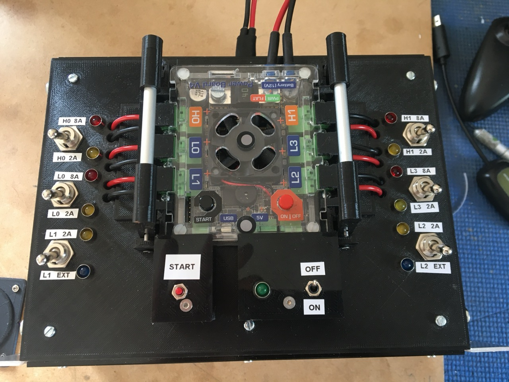
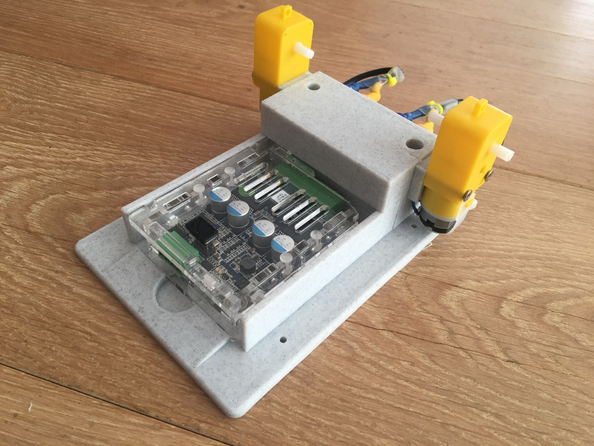
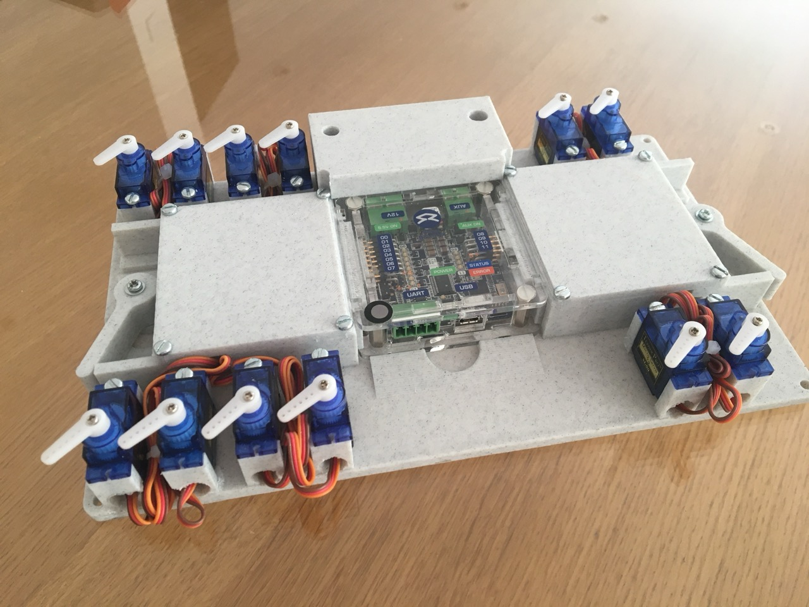

# Test Procedures

Whilst we can't test every item in the kit, the majority of items are tested using the procedures below.
These tests are optimised for use with our SR v4 kit testing jigs.

The output CSVs of these test scripts can be used to update the inventory, both the location of the item and the `condition` field.

## Brain Board

Here we are testing that the KCH power circuit and that the Pi can boot and execute robot code.

For this test you will need:

- A 12 volt power supply with adapter to Camcon.
- A USB stick
- An SD card flashed with the current [robot image](https://github.com/srobo/robot-image/releases/latest).

<!-- cspell:disable -->
```python
from pathlib import Path
import RPi.GPIO as GPIO

asset_file = Path("/proc/device-tree/hat/custom_0")
serial_file = Path("/sys/firmware/devicetree/base/serial-number")
results = {}
fieldnames = ['asset', 'passed', 'serial', 'kch_asset']
logfile = Path('tested_kchs.csv')
new_log = not logfile.exists()

with open(logfile, 'a', newline='') as csvfile:
    writer = csv.DictWriter(csvfile, fieldnames=fieldnames)
    if new_log:
        writer.writeheader()
    try:
        results['passed'] = False  # default to failure
        results['serial'] = serial_file.read_text()
        results['kch_asset'] = asset_file.read_text()
        GPIO.setmode(GPIO.BCM)
        GPIO.setup([24, 10, 25, 27, 23, 22, 4, 18, 17], GPIO.OUT, initial=GPIO.HIGH)
        results['passed'] = True
    finally:
        output_writer.writerow(results)
```
<!-- cspell:enable -->

Test steps:

1. Copy the above block of code into a file called `robot.py`. This should be the only file on the USB stick.
2. Insert the test SD card.
3. Plug the USB stick into the Pi.
4. Connect the 12V power supply to the brain board's Camcon connector.
5. 3 Green LEDs on the Camcon end of the board will light.
    - If they don't light immediately this board has failed, go to step 9.
6. The 5 boot LEDs will light in order.
    - If the first LED has not lit within 20 seconds this board has failed, go to step 9.
    - If all 5 LEDs have not lit within approximately a minute this board has failed, go to step 9.
7. The OK LED should then light a few colours before stabilising on green.
    - If the LED stabilises on red this board has failed, go to step 9.
    - If the LED has not lit within 20 seconds try replugging the USB stick. If it continues to not light this board has failed, go to step 9.
8. The A, B & C LEDs should now all be lit white. If they are not this board has failed.
9. Disconnect the board and remove the USB stick and SD card, making a separate pile for boards that failed.
10. Repeat steps 2-9 for the next board.
11. Copy the `tested_KCHs.txt` file off the USB stick. This is the KCH asset codes of all the passing brain boards.

## Power Board

Here we are testing all outputs can be enabled and current sense is functioning.
Additionally, we test the buzzer, LEDs and start button are functioning and finally we test both the software and hardware undervoltage protection.

For this test you will need:

- The power board testing jig, pictured below
- High current power supply (Dell DPS-750TB)
- USB controllable power supply (Tenma 72-2545)
- Power supply switcher


<!-- TODO add picture of switcher connection -->

!!! note

    While testing undervoltage, errors will be printed about failing to connect to the board. This is expected behaviour.

Test steps:

1. Connect up the high current PSU and USB controlled PSU to the switcher circuit.
2. Connect the switcher circuit to the test jig.
3. Set the USB controlled PSU to 12V and 3A.
4. Set all switches on the jig to up position.
5. Set the on/off switch to on.
6. Check that the battery cable has no exposed copper.
7. Connect a USB cable to the board to test.
8. Slide board into the jig from the top.
9. Insert both sets of side plugs, ensuring they are fully inserted.
10. Connect the board's XT60 connecter to the rear of the jig.
11. Run the script and follow its instructions:<br>
    `kit_test power_v4 --fw-ver 4.4.2 --test-uvlo --log power_testing.csv`
12. Remove board making a separate pile for boards that failed.
13. Repeat steps 5-10 and follow the script's instructions for the next board.

## Motor Board

Here we are testing the both motor outputs function and that the current sensing is functional.

For this test you will need:

- The motor board testing jig, pictured below
- A power supply capable of 12 volts at 3 amps
- 2x 4.7 Ohm power resistor with banana plugs



Test steps:

1. Unplug the motors from the jig.
2. Connect the 4.7 Ohm resistors with banana plugs in place of the motors.
3. Connect jig to PSU using banana leads.
4. Set the PSU to 12V and 3A.
5. Connect a USB cable to the board to test.
6. Slide board into the jig from the bottom.
7. Run the script and follow its instructions:<br>
   `kit_test motor_v4 --fw-ver 4.4.1 --log motor_testing.csv`
8. Remove board making a separate pile for boards that failed.
9. Repeat steps 5-6 and follow the script's instructions for the next board.

## Servo Board

Here we are testing that all servo outputs are functional.
Note however, that unless a separate 5 volt power supply is connected to the third jig input, only the first 8 servos will move.

For this test you will need:

- The servo board testing jig, pictured below
- A power supply capable of 12 volts at 0.5 amps



Test steps:

1. Connect jig to PSU using banana leads to the leftmost connections. <!-- TODO add connector colours -->
2. Set the PSU to 12V and 0.5A.
3. Connect a USB cable to the board to test.
4. Slide board into the jig from the bottom.
5. Rotate the levers on both sides to connect the servos.
6. Run the script and follow its instructions:<br>
   `kit_test servo_v4 --fw-ver 4.3 --log servo_testing.csv`
7. Remove board making a separate pile for boards that failed.
8. Repeat steps 3-5 and follow the script's instructions for the next board.

## Arduino

Here we are testing that all the pins on the Arduino are functional.

For this test you will need:

- The Arduino test shield

Test steps:

1. Attach the test shield to the Arduino.
2. Connect a USB cable to the Arduino.
3. Run the script and follow its instructions:<br>
   `kit_test arduino --log arduino_testing.csv`
3. Disconnect the Arduino making a separate pile for Arduinos that failed.
4. Repeat steps 1-2 and follow the script's instructions for the next Arduino.


## Camera

Here we are testing that the camera is accessible and can capture undistorted images.

For this test you will need:

- A printed [test marker](./test-marker.pdf)

!!! note

    For SR2025 we also need to include the `--collect-asset` option since we have not recorded currently recorded all the serial numbers of the cameras.

Test steps:

1. Connect the webcam to the computer
2. Run the script and follow its instructions:<br>
   `kit_test camera --log camera_testing.csv`
3. Disconnect the camera making a separate pile for cameras that failed.
4. Repeat step 1 and follow the script's instructions for the next camera

## Batteries and Chargers

There are no automated tests for the batteries or chargers.
However, these items need both testing and collation.

Prior to any testing, the batteries and chargers need to have their asset codes manually scanned so that the inventory can be updated.

Next the IMAX B6 Chargers are used to storage charge the batteries.
This will be the test for both the battery and the charger.
To access storage charge follow the [competitor documentation](https://studentrobotics.org/docs/kit/batteries/imax_b6_charger#ChargingChecklist) except when reaching the "LiPo BALANCE" screen continue pressing `Inc.` until the screen reads "LiPo STORAGE".

## USB Cable Testing

As of SR2024, the vast majority of kit issues reported throughout the year and to the helpdesks are due to faulty USB cables.
For SR2025's Kit Testing we are using a [Treedix USB cable tester](https://www.amazon.co.uk/dp/B0CDP7SJZ1) to try and reduce the number of faulty cables we give out.

## Additional Notes

In order to run all the tests in parallel you would need more power supplies than we have.
The brain board test can be performed using a power board and battery instead of the power supply.
If so, make sure to use a power board which has passed its own testing.
