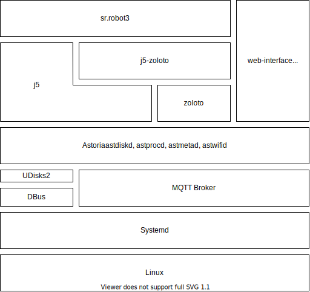

# Kit Software

This section contains information about the software used for the Kit.

The current iteration of the software used on the kit was first introduced for SR2022.

## Kit Stack

The kit software comprises of a number of modular components, shown in the following diagram:

Some components are written by Student Robotics, some are open source projects we work on, and some components are standard off-the-shelf open source software.

## SR-Specific Components

The following components are written and maintained by Student Robotics volunteers. The software may be very specific to our use cases, although we aim to try and generalise software where feasible.

### `sr.robot3`

[GitHub Repo](https://github.com/srobo/sr-robot3)  [Documentation](https://srobo.github.io/sr-robot3)

`sr.robot3` is the student-facing Python API library. It enables students to control hardware and software on the kit.

It replaces the previous `sr.robot` library.

### Astoria

[GitHub Repo](https://github.com/srobo/astoria)  [Documentation](https://srobo.github.io/astoria)

Astoria is a suite of programs that make up the "Robot Management System". It is responsible for running students' code from USB drives and allows control and inspection of the current state of a robot.

Astoria replaces the herdsman application that was used before it.

## Third-Party Components

The following components are not maintained by Student Robotics, but are maintained by current volunteers.

### `j5`

[GitHub Repo](https://github.com/j5api/j5)  [Documentation](https://j5.org.uk/en/stable/)

j5 is a Python 3 framework that aims to make building consistent APIs for robotics easier. It provides common code to build safe student-facing APIs and control the boards we include in our kit.

j5 is maintained by the "j5 Steering Committee", a group of volunteers dedicated to the project. Many of the members on the "j5 Steering Committee" are also SR volunteers.

### Zoloto

[GitHub Repo](https://github.com/realorangeone/zoloto)  [Documentation](https://zoloto.readthedocs.io/en/stable/)

Zoloto is a fiducial marker system powered by OpenCV and the Aruco marker system.

Zoloto is currently maintained by an individual who is also a SR volunteer.

### `j5-zoloto`

[GitHub Repo](https://github.com/j5api/j5-zoloto)

`j5-zoloto` is a library that contains common components for integrating Zoloto with j5-based APIs.

It is maintained by the j5 Steering Committee.

## Off-The-Shelf Components

The following components are not maintained by SR and we do not substantially contribute to them.

### Mosquitto MQTT Broker

[Mosquitto Website](https://mosquitto.org/)

We use Mosquitto as a MQTT broker on the robots. This is a requirement for Astoria.

### Yocto Project

[Yocto Project Website](https://yoctoproject.org/)

Yocto is used for building the OS for our brain boards. 

All of our yocto layers and configuration can be found on our GitHub tagged with the [yocto topic](https://github.com/search?q=topic%3Ayocto+org%3Asrobo&type=Repositories).

