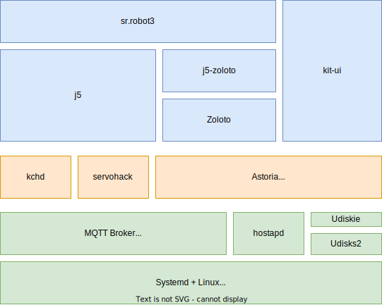

# Kit Software

This section contains information about the software used for the Kit.

The current generation of the software used on the kit was first introduced for SR2022.

## Kit Stack

The kit software comprises of a number of modular components, shown in the following diagram:

Some components are written by Student Robotics, some are open source projects we work on, and some components are standard off-the-shelf open source software.

Broadly, the components are arranged into three layers, shown in different colours above:

- User Facing (Blue): Components that are directly interacted with by users.
- Middleware (Orange): Software components that are indirectly interacted with.
- Operating System (Green): Underlying OS and software.

## User Facing Components

### `sr.robot3`

[GitHub Repo](https://github.com/srobo/sr-robot3) | [Documentation](https://srobo.github.io/sr-robot3)

`sr.robot3` is the student-facing Python API library. It enables students to control hardware and software on the kit.

It replaces the previous `sr.robot` library.

### Kit UI

[GitHub Repo](https://github.com/srobo/kit-ui)

The Kit UI is a web-based interface for viewing logs from usercode. It can be accessed by connecting to the robot WiFi hotspot or via the ethernet connection. The web interface also offers some limited modification of the robots environment (zone, mode) and has some controls for running of code.

The Kit UI communicates with Astoria via MQTT over WebSocket.

### `j5`

[GitHub Repo](https://github.com/j5api/j5) | [Documentation](https://j5.org.uk/en/stable/)

j5 is a Python 3 framework that aims to make building consistent APIs for robotics easier. It provides common code to build safe student-facing APIs and control the boards we include in our kit.

j5 is maintained by the "j5 Steering Committee", a group of volunteers dedicated to the project. Many of the members on the "j5 Steering Committee" are also SR volunteers.

### Zoloto

[GitHub Repo](https://github.com/realorangeone/zoloto) | [Documentation](https://zoloto.readthedocs.io/en/stable/)

Zoloto is a fiducial marker system powered by OpenCV and the Aruco marker system.

Zoloto is currently maintained by an individual who is also a SR volunteer.

### `j5-zoloto`

[GitHub Repo](https://github.com/j5api/j5-zoloto)

`j5-zoloto` is a library that contains common components for integrating Zoloto with j5-based APIs.

It is maintained by the j5 Steering Committee.

## Middleware

### Astoria

[GitHub Repo](https://github.com/srobo/astoria) | [Documentation](https://srobo.github.io/astoria)

Astoria is a suite of programs that make up the "Robot Management System". It is responsible for running students' code from USB drives and allows control and inspection of the current state of a robot.

Astoria replaces the herdsman application that was used before it.

### KCH Daemon (`kchd`)

[GitHub Repo](https://github.com/srobo/kchd) 

The KCH Daemon (`kchd`) is a background process that listens for state updates from Astoria and sets the lights on the KCH appropriately.

It connects directly to the MQTT broker.

### Servohack

[Source Code](https://github.com/srobo/robot-image/blob/main/sources/meta-srobo/recipes-robot/servohack/servohack/servohack.py)

Servohack is a temporary workaround for the "Pink LED of Death (PLOD)" bug in the Servo Board. It listens for state events from Astoria and turns the USB power lines off and on when a USB drive containing usercode is removed. It only does this when code has been run.

Whilst this is not 100% effective at mitigating the bug, it manages it *most* of the time.

## Operating System

### Yocto (`robot-image`)

[GitHub Repo](https://github.com/srobo/robot-image) | [Yocto Project Website](https://yoctoproject.org/)

We use Yocto to build the operating system image for our kit.

### Mosquitto MQTT Broker

[Mosquitto Website](https://mosquitto.org/)

We use Mosquitto as a MQTT broker on the robots. This is a requirement for Astoria.

### Hostapd

[Website](https://w1.fi/hostapd/)

Hostapd is a daemon that can be used to broadcast a WiFi Access Point. On our kit, it is started by `astwifid`.

### Udiskie

[GitHub Repo](https://github.com/coldfix/udiskie)

Udiskie is an auto-mounter for removable media. We use it to automatically mount USB drives when they are inserted. Udiskie does not interact with Astoria at all, both components talk to Udisks.

_It should be noted that we are looking to replace this component with something simpler._

### Udisks 2

[Website](https://www.freedesktop.org/wiki/Software/udisks/)

Udisks is a daemon that defines an API for interacting with storage devices over DBus. We query it from Astoria (`astdiskd`) to determine when a disk has been inserted or removed.

_It should be noted that we are looking to replace this component with something simpler._
